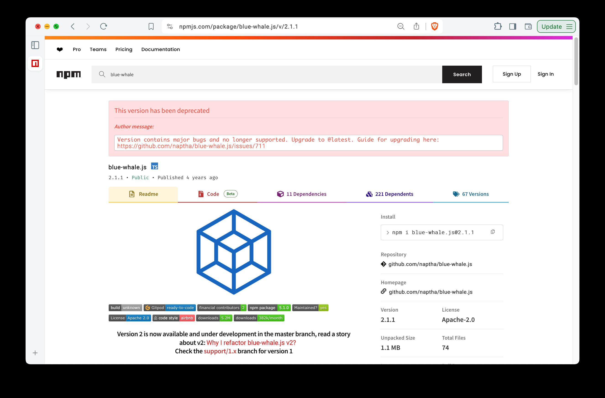

# Screenpear

# Dev Run
```shell
poetry install
poetry run python screenpear/__init__.py --src data/image.jpg
```

# Intended Results
See a mocked example of the intended results below
### Input


### Output

